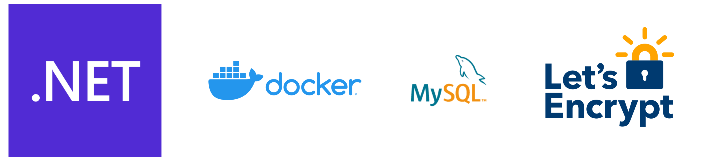

# .NET5, Docker, Nginx, MySQL & Let's Encrypt


This starter template will get you running out of the gate with a .NET5 Blazor project, a fully functioning MySQL database, and free SSL certificates through Let's Encrypt.

## Why?
Because I'm cheap and want to host my entire project for $5 on a DigitalOcean droplet, Vultr instance, or whatever other cheap service I want to and then scale up when necessary.

## Getting Started
1. Clone the repository
1. Copy the `example.env` into a file named just `.env` and edit the values to your liking.
1. Run docker-compose
    - In development do `docker-compose up`
    - In production do `docker-compose --profile production up -d`

## You Should Know
- If you are using a docker-compose version below 1.28 then you'll want to upgrade since docker-compose profiles were introduced with version 1.28. If you're using DigitalOcean's already configured docker droplets then you'll probably need to upgrade. You can do that pretty easily by running this command:
  ```
  sudo curl -L "https://github.com/docker/compose/releases/download/1.29.2/docker-compose-$(uname -s)-$(uname -m)" -o /usr/local/bin/docker-compose
  ```
- The connection string to the MySQL instance is in an environment variable named `ConnectionString` but the application isn't actually doing anything with it. It's just there to make it easier for you to get going.
